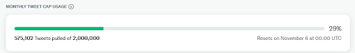
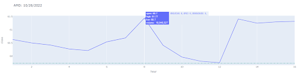

Popular Stocks
==============


# Part 1
## Requirements:
>For the data collection part of this project, we need to either download or produce 2GB of data. This data will need to be processed by Spark, and therefore needs to be formatted in a way that is readable by Spark.
>Specifically for our project, we are expecting to get data that will tell us how popular stocks from the NASDAQ100 are. By popularity, we mean how often people are tweeting about the stocks in hour long segments. We also want to compare this popularity with the price graphs for each of these stocks, to see if a sudden change in price results in an uptick in popularity. One thing we wanted to do, but weren’t able to, was get enough geolocation info to see if there’s any trends that counter the overall trend.
	
## Design:
>Rules:
 Each rule contains multiple instances of hash_tags or cash_tags by the using OR operator. This allows us to catch relevant tweets and not go over the rule cap.

## Data:
>Every tweet has a lot of data associated with it, but we don’t need all of a tweet’s data for our project. With our project, we want to judge the popularity of stocks across the time we’re collecting data. We may also want to see if there are any interesting trends with geolocation data.
	When we first started collecting data, this is the data we believed we needed: tweet id, text, public metrics, creation time, non public metrics, and poster info such as creation time, author id, geographical id, and public metrics. This proved to be not enough info as we misunderstood some fields and our rules were matching to tweets without a stock tag in its text.
	We then refined the data to include the fields above and: place fields including full name and country, and extension fields for referenced tweets. These extra fields allowed us to determine which stock a tweet is about based on the tweet it’s replying to.

## Challenges:
>Some challenges required us to change some design decisions we’ve already made. We found that Spark could not handle large json files, as it would break with files of well above 50MB. This caused us to reassess the streaming client.
	A few days into collecting tweets, we found examples of tweets that our rules would match, but the stock tags we’re interested in would not show up in those tweets. This is because tweets that respond to text that matches our rules will be caught in our stream. To find the stock this reply is about, we needed to get the tweet info of tweets in that conversation.
	
## Implementation:
>We used Tweepy to interact with the Twitter API. When doing a filtered stream from Twitter, we first need to add rules to the bearer token we are doing the stream with. We created a script to scrape data from a website listing info about all of the stocks on the NASDAQ100 list found here: https://www.slickcharts.com/nasdaq100. With the data from this website, we created 17 rules with 6 stock tags. These stock tags are prepended with a # or $, depending on the bearer token. This script produces a rule like “#AAPL OR #MSFT OR #AMZN OR #TSLA OR #GOOG OR #GOOGL”.
	After we assign rules to the bearer tokens, we then need to retrieve the data from twitter. Using tweepy, we created behaviors for when we connect to the stream, get data in json format, and for when we disconnect from the stream. These behaviors are defined in Mystream.py. We also specified the data we want from each tweet that matches our rules in twitter.py. The data we collected is discussed in the Design section. The file we write to changes after the current file reaches 50MB.


## Evaluation:
>We have collected above 1.3 GB, and are still collecting data. We believe we will reach 2GB by Sunday, but we still plan to keep collecting data past 2GB. We weren’t able to get much geolocation data, so we can’t use that field.
	While we have been collecting data for 2+ weeks, part of that data is unusable because we are missing context for tweets in a conversation. The data we are collecting now is data that will be usable for our needs, and we do not plan to change any parameters from here on out.
	
	
## Screenshots:




# Part 2
## Requirements
> Our data was retrieved from two sources. We got the tweets using Twitter’s API and tweepy. The stock price data came from Polygon.io API. Many tweets our twitter API rules retrieved did not have a stock ticker in the text of the tweet. Instead, it was replying or otherwise participating in a conversation about a stock. We needed to include the text of the tweets in the conversation with the text of the tweet we matched to identify which stock a tweet was talking about.
We also happened to match tweets that did have a stock hashtag in them, such as “#EBAY”, but many tweets with that hashtag are not talking about eBay stock, but are talking about item listings.

## Design
> There were a few steps between retrieving the data, and getting the information we wanted from it. Those steps were:
Identify which stocks a tweet is talking about.
<ul>
<li>Extract hashtags</li>
<li>Remove irrelevant columns</li>
<li>Filter</li>
</ul>

After filtering the data, we have just the rows and columns we were interested in. Much of the data displayed on the webpage is related to counting. We’re showing how often people are tweeting about stocks by the hour, by the day, and which hashtags people are using in discussions about those stocks. Our tables must have a single stock ticker as a value per row, so we can make queries on those tickers. To make counting those easier, we needed one ticker and one hashtag per row.

## Implementation
> The technologies we used in Part 2 were Pyspark and MySQL. We used Pyspark to read the multiple json files, and to generate most of the tables you see represented on our webpage. Those tables were then stored in a MySQL database. 
	For steps 1 and 2 in the design section above, we used regex to match patterns of the cashtags and hashtags of the 102 stock tickers we collected to identify the tweets. Then we matched hashtags that did not match hashtags for the stocks to extract the hashtags. After identifying the tweets and hashtags in those tweets, we then used Pyspark SQL to select only the columns we needed. Those columns were timestamp, tweet ID, tweet text, stock tickers, and hashtags.
	After removing most columns from the tweets dataframes, we then filtered the tweets dataframe containing stock discussion we matched with a hashtag, not a cashtag. One example of filtering is eBay. Most tweets containing #EBAY were not about eBay stock, but automated posts about listings placed on eBay. To remove these tweets, we dropped columns where the tickers column contains “EBAY” and the text starts with “Check out.”
	Once the tweets hashtag dataframe was filtered, we combined it with the tweets cashtag dataframe. We then used the explode_outer function on the tickers and tags columns to help us count the occurrences of these tickers and tags. For most of the tables we display on the webpage, we create those tables using SQL count and group by on different columns. For the 3D graph seen in part 3, we use a rank over partition to get the most common hashtag used with a stock for every hour.

## Evaluation
> Towards the beginning of this part, we tried timing the reading of the tweets only. The time it took to read the data was not that long, so any trends we saw in time was likely due to caching. When timing more of our Pyspark operations, the time/worker relationship was more consistent. The following Workers/Time graph was run on 0.5GB of data, and the Data Size to Time graph was run with 2 workers.


Screenshots/Snippets
```python
   popular_tags_hourly_count = spark.sql(
       "select * from (select *, row_number() over (PARTITION BY t_hour ORDER BY cnt desc) rank from tags_hourly_count) tmp where rank<=5 order by t_hour desc, rank")

```

```python
   time_tickers_explode_df = time_tickers_tags_df.withColumn(
       "tickers", explode_outer("tickers"))
   
   time_tickers_tags_explode_df = time_tickers_explode_df.withColumn(
       "tags", explode_outer("tags"))

```
## TA Strike Impact
> In part 2 of the lab, we were wondering why varying the number of spark-workers in our for-loop produced the same result as fixing the number. We thought that this may be due to some caching, but when we turned off caching not much changed. 
We also had an issue with writing to our DB, where one column of our data was completely missing, which took a couple of days to debug.

# Part 3
## Requirements
> We need to create an interactive web interface to explore our analyzed data. This application should be high-speed by precomputing all values and storing them in a Database.

## Design
> The user can input some information that they are interested in and get back the relevant information via forms. The user also can directly manipulate the perspective or certain attributes of our graphs.


## Implementation
> We used the pyecharts and plotly libraries to graphically display our data which we acquired from our DB through the mysql connector. Additionally, we used CSS(Bootstrap) Bootstrap is a free, open source front-end development framework for the creation of websites and web apps. And html to format our charts and graphs in a visually appealing way. 


Our framework was Django and we created one view for each graph or chart. For the plotly chart, we rendered it directly in home-page template by using plotly’s to_html(). For charts1 through 4 we used href to redirect to the url that contains the charts view and back to the home-page.

## Evaluation
> We found our website to be pretty interactive aside from chart1, which just displayed frequencies of tweets for each stock. A potential improvement would be to give the user more freedom by allowing them to give tags in addition to tickers and time-frames. This would allow for a backwards search of stocks.
	We found that our charts were mostly high-speed, but when we used larger datasets, some of the graphs would take a couple seconds longer to load. A way to increase performance would be to statically render our data instead of having the server render it. The downside of this for our application is that we would not be able to update it with more recent data. Also, for the plotly graph, we would have to create many graphs, but the user is probably not going to view every graph.


## Screenshots

**First page of our website:**


**Examples of graph (hover over point to interact):**
The user can input a date and a stock ticker to get the hourly financial information and the most used hashtags.




**Chart1:**
This chart shows the total frequencies of tweets for the top 5 stocks throughout the whole data collection process.


**Chart2 (can scroll through the different stocks):**
This chart visibility separates the number of actual tweets versus retweets for each stock.


**Chart3 (can rotate model and hover over rectangles):**
This chart helps the user visualize what tags are used for each stock, hour, date combination.


**Chart4 (can select dates or select auto-play):**
This chart shows the daily frequencies of tweets for the top 5 stocks as pie-charts.


**Reference:**
Django template:https://docs.djangoproject.com/en/4.1/contents/
Bootstrap:https://getbootstrap.com/docs/3.4/css/ 
JS:https://getbootstrap.com/
Example using echart template(Pyechart)
https://echarts.apache.org/examples/en/index.html#chart-type-pie


